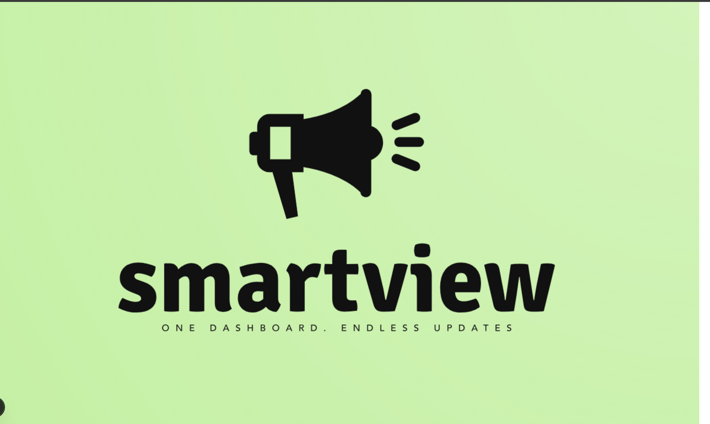
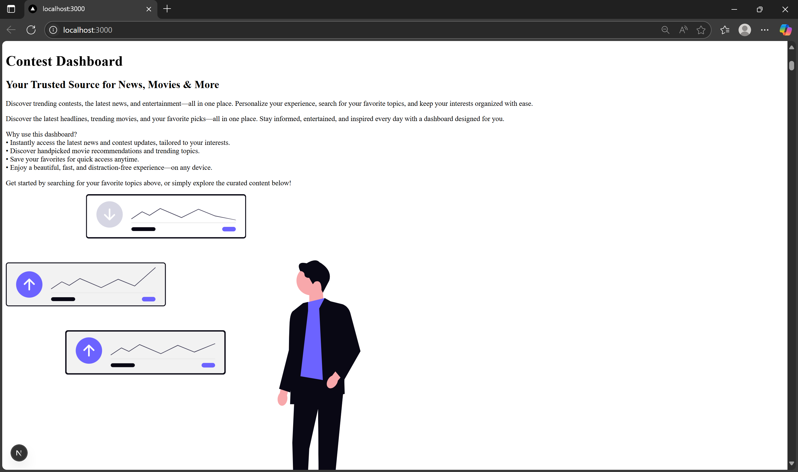
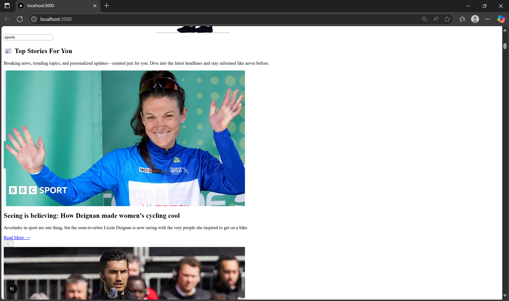

This is a [Next.js](https://nextjs.org) project bootstrapped with [`create-next-app`](https://nextjs.org/docs/app/api-reference/cli/create-next-app).

## Getting Started

First, run the development server:

```bash
npm run dev
# or
yarn dev
# or
pnpm dev
# or
bun dev
```

Open [http://localhost:3000](http://localhost:3000) with your browser to see the result.

You can start editing the page by modifying `app/page.tsx`. The page auto-updates as you edit the file.

This project uses [`next/font`](https://nextjs.org/docs/app/building-your-application/optimizing/fonts) to automatically optimize and load [Geist](https://vercel.com/font), a new font family for Vercel.

## Learn More

To learn more about Next.js, take a look at the following resources:

- [Next.js Documentation](https://nextjs.org/docs) - learn about Next.js features and API.
- [Learn Next.js](https://nextjs.org/learn) - an interactive Next.js tutorial.

You can check out [the Next.js GitHub repository](https://github.com/vercel/next.js) - your feedback and contributions are welcome!

## Deploy on Vercel

The easiest way to deploy your Next.js app is to use the [Vercel Platform](https://vercel.com/new?utm_medium=default-template&filter=next.js&utm_source=create-next-app&utm_campaign=create-next-app-readme) from the creators of Next.js.

Check out our [Next.js deployment documentation](https://nextjs.org/docs/app/building-your-application/deploying) for more details.


# 📰 Personalized Contest Dashboard

A fully functional, customizable dashboard built with **Next.js**, **Tailwind CSS**, **Redux Toolkit**, and **TypeScript**.  
It fetches real-time news and movie recommendations, allows favorites, and supports dark mode with drag-and-drop UI.

---

## 🚀 Features

- 📰 Personalized News (via NewsAPI)
- 🎬 Movie Recommendations (via OMDb API)
- ❤️ Add to Favorites
- 🌙 Dark Mode Toggle
- 🔍 Debounced Search
- ↕️ Drag and Drop Card Reordering
- ✅ Unit and E2E Testing (Jest + Cypress)
- ⚡ Fully Responsive and Fast

---

## 📁 Folder Structure

personalized-dashboard/
├── components/
├── pages/
├── redux/
├── services/
├── styles/
├── utils/
├── public/
├── tests/
├── tests/
└── package.json


---

## 🛠️ Technologies Used

- [Next.js](https://nextjs.org/)
- [React 19](https://react.dev/)
- [Redux Toolkit](https://redux-toolkit.js.org/)
- [Tailwind CSS](https://tailwindcss.com/)
- [TypeScript](https://www.typescriptlang.org/)
- [Framer Motion](https://www.framer.com/motion/)
- [Axios](https://axios-http.com/)
- [OMDb API](https://www.omdbapi.com/)
- [NewsAPI](https://newsapi.org/)

---

## 🔐 Environment Variables

Create a `.env.local` file in the root:

```env
NEXT_PUBLIC_NEWS_API_KEY=your_news_api_key
NEXT_PUBLIC_OMDB_API_KEY=your_omdb_api_key


## 🖼️ Screenshots

### 🏠 Homepage


### 🎬 Dashboard


### 💬 Chat Page

